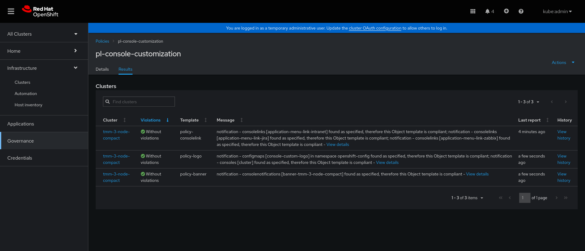
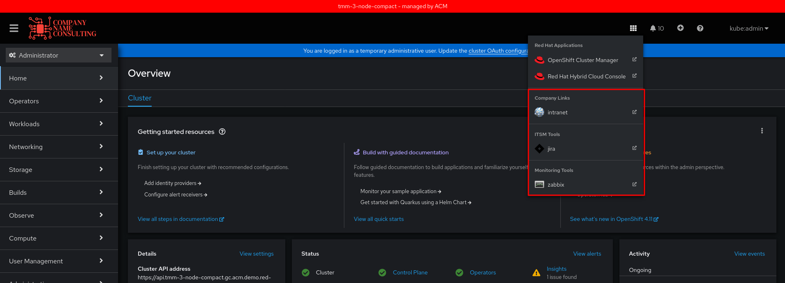

# Red Hat Advanced Cluster Management
## Policy - pl-custom-console


```shell
# oc new-project custom-policy


# IMAGE=`base64 -w0 logo.png`


# oc create configmap cm-policy-data \
--from-literal=logo.png=${IMAGE} \
--from-literal=intranet-name="intranet" --from-literal=intranet-section="Company Links" \
--from-literal=intranet-url="https://intranet.com" \
--from-literal=intranet-icon="https://icons.iconarchive.com/icons/artua/mac/32/Intranet-icon.png" \
--from-literal=jira-name="jira" --from-literal=jira-section="ITSM Tools" \
--from-literal=jira-url="https://jira.com" \
--from-literal=jira-icon="https://icons.iconarchive.com/icons/fa-team/fontawesome-brands/48/FontAwesome-Brands-Jira-icon.png" \
--from-literal=monitoring-name="zabbix" --from-literal=monitoring-section="Monitoring Tools" \
--from-literal=monitoring-url="https://zabbix.com" \
--from-literal=monitoring-icon="https://icons.iconarchive.com/icons/emey87/trainee/32/System-monitoring-icon.png" \
-n custom-policy

# oc create -f pl-custom-console.yaml
```

&nbsp;

## Policy


&nbsp;

## Policy
